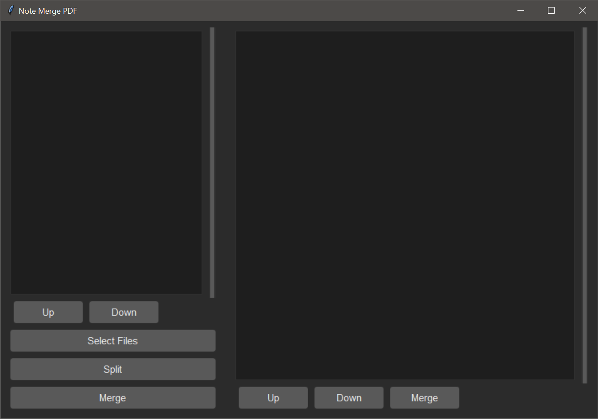

# NoteMergePDF

NoteMergePDF is a Python-based desktop application for merging and managing PDF files. It provides an intuitive graphical user interface (GUI) for selecting, reordering, splitting, and merging PDF files or specific pages. This tool is ideal for students, professionals, and anyone who frequently works with PDF documents.

## Features

- **Merge PDFs**: Combine multiple PDF files into a single document.
- **Split PDFs**: Extract individual pages from PDF files.
- **Reorder Files**: Easily reorder selected PDF files before merging.
- **Page Selection**: Select specific pages from multiple PDFs and merge them into a new document.
- **User-Friendly Interface**: Built with Tkinter for a clean and responsive GUI.

## Installation

1. Clone the repository:
   ```bash
   git clone https://github.com/IacobucciB/NoteMergePDF
   cd NoteMergePDF
   ```

2. Install the required dependencies:
   ```bash
   pip install -r requirements.txt
   ```

3. Run the application:
   ```bash
   python main.py
   ```

## Usage

1. Launch the application.
2. Use the **Select Files** button to add PDF files to the list.
3. Reorder files using the **Up** and **Down** buttons.
4. Split files into individual pages using the **Split** button.
5. Select specific pages or files and merge them using the **Merge** button.
6. Save the output PDF to your desired location.

## Screenshots


*Screenshot of the application's main interface.*

## Requirements

- Python 3.7 or higher
- Dependencies listed in `requirements.txt`

## Logging

The application logs all operations (e.g., file selection, merging, splitting) to help with debugging and tracking actions. Logs are displayed in the console.

## Contributing

Contributions are welcome! To contribute:

1. Fork the repository.
2. Create a new branch for your feature or bug fix:
   ```bash
   git checkout -b feature-name
   ```
3. Commit your changes and push to your fork:
   ```bash
   git commit -m "Add feature-name"
   git push origin feature-name
   ```
4. Open a pull request.

## License

This project is licensed under the MIT License. See the [LICENSE](LICENSE) file for details.


